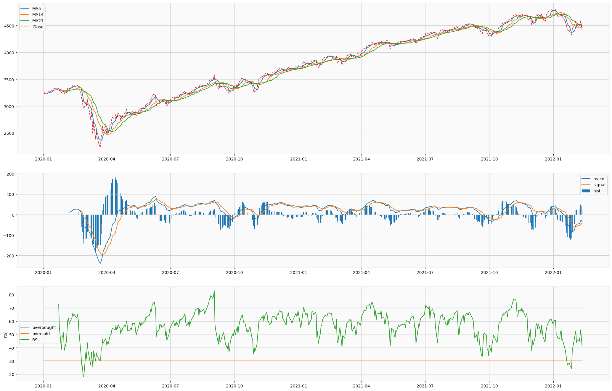

# FinAnalyzer




**FinAnalyzer** is a web-based financial analysis tool built using the [MLJAR-Mercury](https://github.com/mljar/mercury) framework. It allows users to fetch financial data from Yahoo Finance, analyze it using technical indicators like Moving Averages (MAs), Moving Average Convergence Divergence (MACD), and Relative Strength Index (RSI), and visualize the results through interactive charts. Whether you're a trader, investor, or financial enthusiast, FinAnalyzer provides an intuitive interface for making data-driven decisions.

---

## ✨ Features

- **Real-Time Financial Data**: Fetches up-to-date financial data from Yahoo Finance.
- **Technical Indicators**: Supports calculation and visualization of key indicators like MAs, MACD, and RSI.
- **Interactive Charts**: Displays data in dynamic and interactive charts for better insights.
- **Customizable Widgets**: Allows users to input parameters like ticker symbols, date ranges, and indicators via a user-friendly interface.
- **Easy Deployment**: Built with MLJAR-Mercury, enabling seamless conversion of Jupyter Notebooks into web applications.

---

## 🛠️ Installation

To set up FinAnalyzer locally, follow these steps:

### 1. Clone the Repository
```bash
git clone https://github.com/nuhyurdev/finAnalyzer-mercury.git
cd finAnalyzer-mercury
```

### 2. Create a Python Virtual Environment
It is recommended to use a virtual environment to manage dependencies:
```bash
python3 -m pip install virtualenv
python3 -m venv my_env
source my_env/bin/activate
```

### 3. Install Dependencies
Install the required Python packages:
```bash
pip install -r requirements.txt
```

The `requirements.txt` file includes the following dependencies:
- `matplotlib`
- `pandas`
- `pandas-ta`
- `numpy`
- `pandas_datareader`
- `requests`
- `mplfinance`
- `beautifulsoup4`
- `mljar-mercury`

### 4. Run the Mercury Server
Start the Mercury server to launch the application:
```bash
mercury runserver --runworker
```

### 5. Access the Application
Open your web browser and navigate to `http://127.0.0.1:8000`. You should see the FinAnalyzer web interface.

---

## 🚀 Usage

### 1. Input Parameters
- **Ticker Symbol**: Enter the ticker symbol of the stock or financial instrument (e.g., `AAPL` for Apple Inc.).
- **Date Range**: Select the range of years for analysis.
- **Indicators**: Choose technical indicators like MACD, RSI, or Volume.
- **Candlestick Chart**: Specify the number of days for the candlestick chart.

### 2. View Results
The application will display interactive charts with the selected technical indicators, allowing you to analyze trends and patterns.

---

## 📂 Project Structure

The project is structured as follows:
- `finAnalyser.ipynb`: The Jupyter Notebook containing the financial analysis code.
- `requirements.txt`: Lists all required Python packages.
- `setup.sh`: Script to set up environment variables.
- `finAnalyzer.png`: Screenshot of the application.

---

## 🛠️ Customization

### Adding Widgets
The application uses a YAML header to define widgets for user input. Here's an example of the YAML configuration:
```yaml
---
title: FinAnalyzer
author: noah
description: Technical analysis application for financial data
show-code: False
params:
   ticket:
      input: text
      label: yahoo finance ticket
      value: "^GSPC"
      row: 1
   year:
      input: range
      label: Select data range of year
      value: [2020,2022]
      min: 2017
      max: 2022
   lastndays:
      input: slider
      label: Select last n days for candlestick chart
      value: 30
      min: 7
      max: 200
   ma_7d:
      label: 7 days Moving averages
      input: checkbox
      value: true
   ma_14d:
      label: 14 days Moving averages
      input: checkbox
      value: true
   ma_21d:
      label: 21 days Moving averages
      input: checkbox
      value: true
   indicators:
      label: Select financial indicators
      input: select
      value: [MACD,RSI]
      choices: [MACD,RSI,Volume]
      multi: True
---
```

### Modifying the Code
You can modify the Jupyter Notebook (`finAnalyser.ipynb`) to add new features or customize the analysis.

---

## 🤝 Contributing

Contributions are welcome! To contribute:
1. Fork the repository.
2. Create a new branch (`git checkout -b feature-branch`).
3. Commit your changes (`git commit -m 'Add new feature'`).
4. Push to the branch (`git push origin feature-branch`).
5. Open a Pull Request.

---

## 📄 License

This project is licensed under the MIT License. See the [LICENSE](LICENSE) file for details.

---

## 🙏 Acknowledgements

- **[MLJAR-Mercury](https://github.com/mljar/mercury)**: The framework used to convert the Jupyter Notebook into a web application.
- **[Yahoo Finance](https://finance.yahoo.com/)**: The source of financial data.
- **[Plotly](https://plotly.com/)**: For creating interactive visualizations.

---

## 📬 Contact

For questions, suggestions, or feedback, feel free to reach out:
- **GitHub Issues**: [Open an Issue](https://github.com/nuhyurdev/finAnalyzer-mercury/issues)
- **Email**: [Your Email Address]

---

*Note: This project is actively maintained and open to contributions. Let's make financial analysis more accessible and insightful together!*
